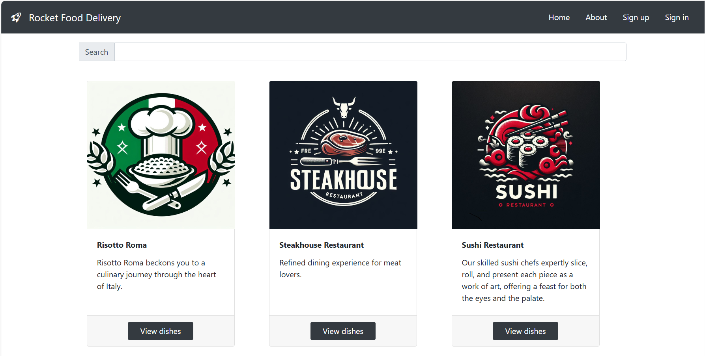

# Rocket Food Delivery

Rocket Food Delivery is a full-stack food delivery app built with Next.js and React for the user interface and Stripe for secure payment processing. The back-end, powered by Strapi, handles user authentication, order management, and restaurant data, with PostgreSQL as the data storage solution. Front-end hosted on Vercel, while AWS S3 stores media assets and the backend is served on an AWS EC2 instance.

You can access this app's backend GitHub repository here: https://github.com/gustavo-ribeiro-santiago/rocket-food-delivery-backend

